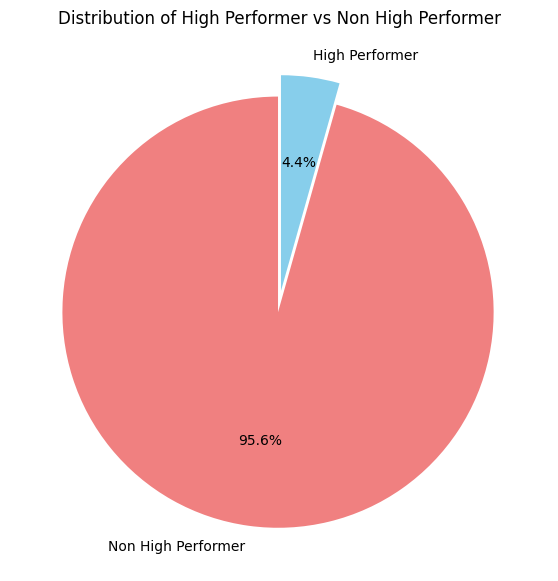
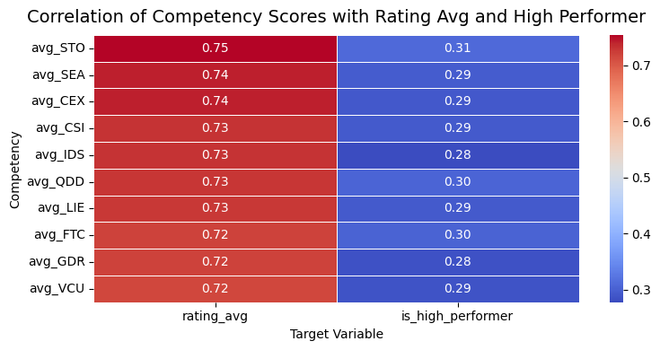
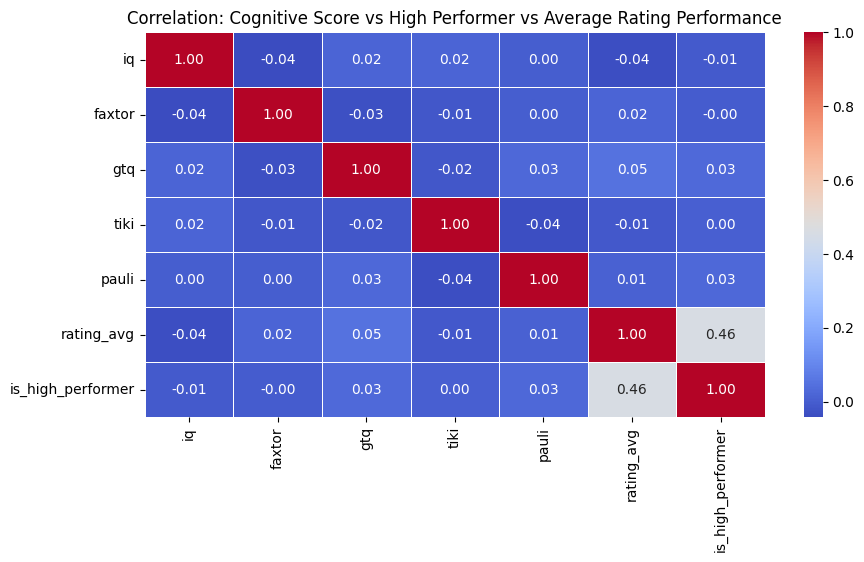
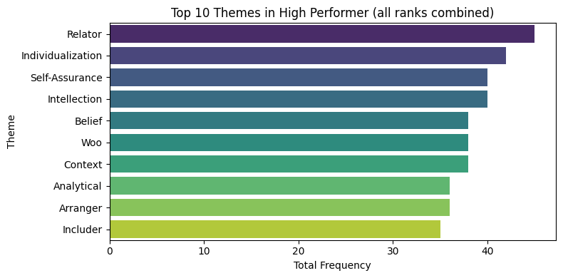
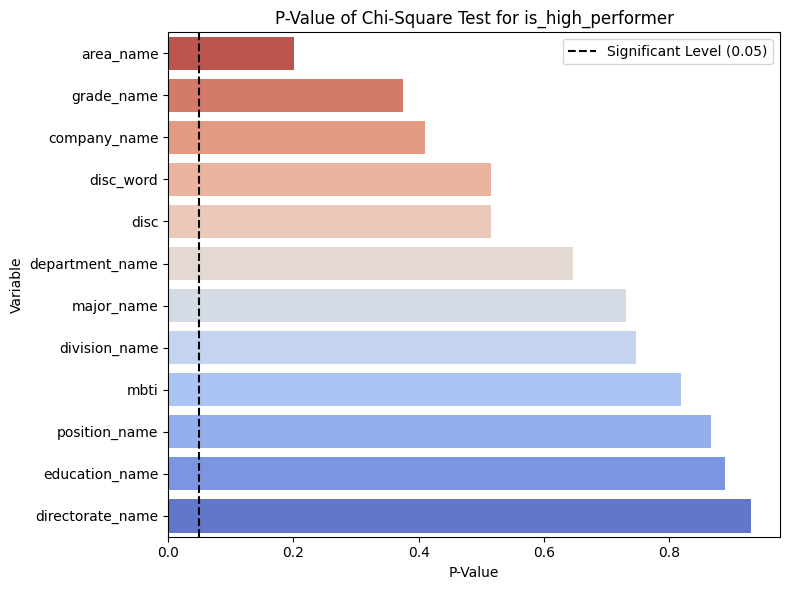
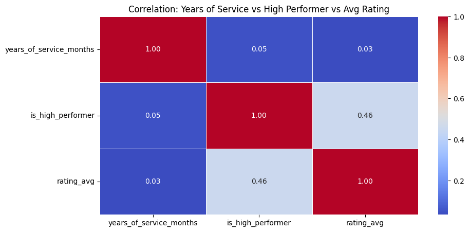

# 🎯 Talent Match Intelligence Dashboard

This project aims to analyze employee performance and develop a data-driven **AI Talent App** to benchmark and visualize talent match rates based on competency, cognitive ability, and experience.  
It was developed as part of the **Data Analyst Case Study 2025**.

---

## 📊 Project Overview

| Step | Description |
|------|--------------|
| **Step 1 — Data Analysis** | Explored employee rating data (2021–2025) and identified key performance drivers. |
| **Step 2 — SQL Logic & Success Formula** | Built a benchmark table and success formula: **0.9 TGV Comp + 0.5 TGV Cog + 0.5 TGV Exp** |
| **Step 3 — Website Talent Dashboard** | Created an interactive Streamlit app for role-based talent analysis and insights visualization. |

---

## 🧩 Key Insights / Visualization

###  **Distribution of High Performer**

Employees With High Performer Criteria Only 4.4%

###  **Correlation of Competency Score VS Average Rating and High Performer**

Average Competency score like STO, SEA, etc has high positive correlation to Average Rating.

###  **Correlation of Cognitive score VS Average Rating and High Performer**

Cognictive Score (IQ,TIki,etc) has weak correlation to Average Rating.

###  **Clifton Themes Analysis**

Relator is the most themes in High Performer Employee

###  **Categorical Analysis (Chi Square Test)**

Categorical variable are not significant to high performer criteria

###  **Year of Service vs Is High Performer and Average Rating**

Year Service has not strong correlation to high performer and average rating

### **Succes Formula**
**Success Formula = 0.9 TGV Competency(STO,SEA,etc) + 0.5 TGV Cognitive (IQ,TIki, etc) + 0.5 TGV Experience (Year of Service (Month))**

### Result : 
- **Low Performance Average:** Average competency score only 3.0 (scale 1–5), with 4.4% classified as High Performers.  
- **Competency Drives Rating:** STO, SEA, and related features strongly influence employee performance.  
- **High Performer Profile:** “Relator” is the most common CliftonStrengths theme among top performers.  
- **Success Formula:** `Final Match = 0.9 TGV_Comp + 0.5 TGV_Cog + 0.5 TGV_Exp`  
- **Average Match Rate:** 79 / 100  

---

## 🧠 Action Plan (Business Recommendation)

| Focus Area | Key Action |
|-------------|-------------|
| Strengthen Competency | Develop focused learning programs for high-impact competencies. |
| Redesign KPI Evaluation | Align performance evaluation with Success Formula. |
| Build “Relator” Culture | Encourage mentorship and collaboration. |
| Improve Engagement | Increase recognition and retention initiatives. |

---

## 💻 Tech Stack

- **Language:** Python
- **Database:** Supabase (PostgreSQL)
- **Libraries:** Streamlit, Pandas, Plotly, NumPy, Seaborn, Matplotlib, etc
- **Data Source:** Employees Profile Dataset ( Check dataset folder)  
- **Deployment:** Streamlit Cloud / Localhost
- **Control Version:** Github

---

## 🚀 How to Run Locally
1. Clone the repository : git clone 'https://github.com/yourusername/talent-match-intelligence.git'
2. Navigate to the project folder : cd talent-match-intelligence
3. Install dependencies : pip install -r requirements.txt
4. Run the dashboard website : streamlit run talent_dashboard.py
5. Dashboard Website : 
